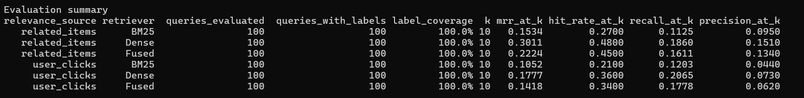
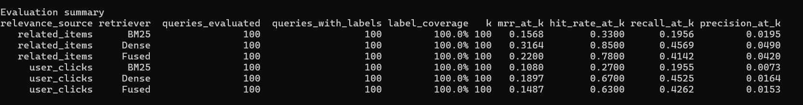
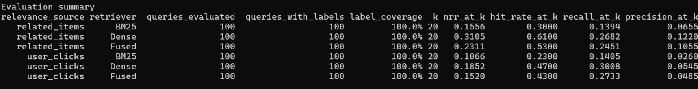
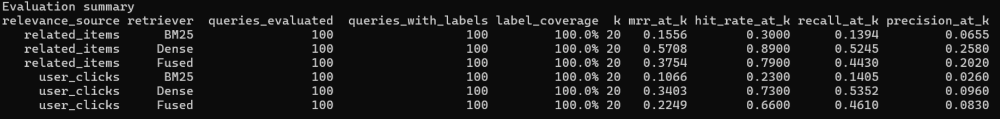
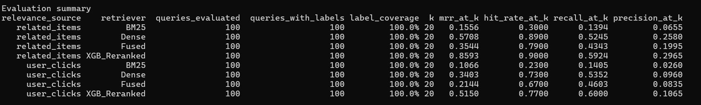

# CraveAI Food Search

CraveAI is an end-to-end food-search application combining lexical retrieval, semantic embeddings, reciprocal rank fusion, and a learned XGBoost reranker. It includes a FastAPI backend, a React and TypeScript UI, containerized services, and Kubernetes deployment manifests.

## Contents

- [Results at a Glance](#results-at-a-glance)
- [Hybrid Search Architecture](#hybrid-search-architecture)
- [XGBoost Learning-to-Rank](#xgboost-learning-to-rank)
- [Evaluation Methodology](#evaluation-methodology)
- [Search Experiments and Results](#search-experiments-and-results)
- [Iteration 1: Semantic Baseline](#iteration-1-semantic-baseline)
- [Iteration 2: Context-Enriched Embeddings](#iteration-2-context-enriched-embeddings)
- [Iteration 3: XGBoost Reranking](#iteration-3-xgboost-reranking)
- [XGBoost Ranking Results](#xgboost-ranking-results)
- [Application and Deployment Architecture](#application-and-deployment-architecture)

## Results at a Glance

- Built a hybrid retrieval pipeline that combines BM25 item-name search with dense semantic search, then fuses candidates with RRF.
- Trained and integrated an XGBoost learning-to-rank model to reorder candidates using query-item relevance features.
- In offline evaluation on 100 queries at `K=20`, improved related-item MRR from **35.44% with RRF to 85.93%** with XGBoost reranking; related-item Hit Rate increased from **79% to 90%**.
- Against user-click labels, improved MRR from **21.44% to 51.50%**, Hit Rate from **67% to 77%**, and Recall from **46.03% to 60.00%**.
- Packaged the API and UI as separate container images, with GitHub Actions workflows for GHCR publishing and Kubernetes manifests for deployment.

The results are from offline evaluation; related-item labels and recorded user clicks are reported as separate relevance signals. The sections below describe the search pipeline, model training, evaluation approach, and experiment history.

## Hybrid Search Architecture

1. **BM25 retrieval** finds candidates with strong lexical matches to item names.
2. **Dense retrieval** compares the query embedding with embeddings of menu item text.
3. **Reciprocal Rank Fusion (RRF)** combines the two candidate rankings.
4. **XGBoost learning-to-rank** scores and reorders the fused candidates.
5. The FastAPI service returns the top results to the React UI.

The embedding text combines item name, menu category, restaurant name, and item description. The embedding model runs through ONNX Runtime; data, indexes, tokenizer, and model paths can be configured for local use or mounted runtime assets.

## XGBoost Learning-to-Rank

The current reranker is an XGBoost LambdaMART-style model using the `rank:ndcg` objective. Training examples are organized into query groups, allowing the model to learn how to order candidates for each query. The current feature-generation workflow creates up to 50 dense-retrieval candidates per query and assigns a binary relevance label from the dataset's `response_item_ids`.

The model uses these query-item features:

- Dense query-item similarity score
- Token overlap with item name, menu category, and item description
- Candidate rank from dense retrieval
- Item rating

The trainer evaluates with `ndcg@10`, uses query-level training and validation groups, and applies early stopping. The resulting model is saved as `api/indexes/xgboost_reranker_model/crave_ai_xgb_reranker.json` and loaded by the API reranking component.

To generate ranking features and train the model, install the API dependencies and configure the tokenizer and ONNX model paths. Run these commands from the repository root:

```powershell
python -m pip install -r api/requirements.txt
$env:CRAVEAI_TOKENIZER_PATH = "C:\path\to\tokenizer.json"
$env:CRAVEAI_ONNX_MODEL_PATH = "C:\path\to\embedding_model.onnx"
python -m api.data.extract_ranking_features
python -m api.model_training_utils.train_xgboost_ranker
```

## Evaluation Methodology

The evaluation workflow compares BM25, dense retrieval, RRF, and XGBoost-reranked results at a consistent cutoff of `K=20`. It reports results separately against two relevance signals:

- **Related-item labels** (`response_item_ids`) measure agreement with the dataset's known relevant items.
- **User clicks** (`clicked_item_ids`) provide a behavioral relevance signal.

The evaluator reports:

- **Hit Rate@K:** how often at least one labeled relevant item appears in the top K.
- **MRR@K:** how highly the first labeled relevant item is ranked.
- **Precision@K:** the proportion of returned top-K items that have a relevance label.
- **Recall@K:** the proportion of labeled relevant items retrieved in the top K.

Hit Rate and MRR emphasize first-page usefulness and early relevant results. Precision describes the relevance density of the displayed list, while Recall tracks coverage of the available labels. Click-based and related-item results are kept separate because they represent different signals.

Run the offline evaluation from the repository root:

```powershell
python -m api.evaluate
```

## Search Experiments and Results

The charts below record the progression from item-description embeddings to richer menu text. Results are reported at the K values shown in each chart; `K=20` is used as the project baseline for first-page comparisons.

### Iteration 1: Semantic Baseline





The initial experiments established BM25, dense retrieval, and RRF baselines against both related-item labels and user clicks. Dense retrieval showed stronger first-result ranking than BM25 in the recorded MRR results, while the comparison highlighted the value of measuring multiple retrieval approaches side by side.

### Iteration 2: Context-Enriched Embeddings

The item representation was expanded to include item name, menu category, restaurant name, and description. In the recorded comparison, dense MRR improved from 31.05% to 57.08%, dense Hit Rate improved from 61% to 79%, and fused Hit Rate@20 improved from 53% to 79%.





For the enriched-text experiment, the recorded RRF results include MRR@20 of 35%, Hit Rate@20 of 79%, and Recall@20 of 43.43% against related-item labels. Against click labels, the recorded RRF MRR@20 is 21% and Recall@20 is 46%. These measurements provide a baseline for evaluating future ranking improvements.

### Iteration 3: XGBoost Reranking

The XGBoost reranker was added after RRF to learn a stronger ordering from query-item features. The following evaluation covers 100 queries at `K=20`; related-item labels and user-click labels are reported separately. The standout result is MRR@20 of 85.93% and Hit Rate@20 of 90.00% against related-item labels, showing that the reranker consistently moves a labeled match near the top of the results.



#### XGBoost Ranking Results

| Relevance signal | Ranking          |     MRR@20 | Hit Rate@20 |  Recall@20 | Precision@20 |
| ---------------- | ---------------- | ---------: | ----------: | ---------: | -----------: |
| Related items    | BM25             |     15.56% |      30.00% |     13.94% |        6.55% |
| Related items    | Dense            |     57.08% |      89.00% |     52.45% |       25.80% |
| Related items    | RRF              |     35.44% |      79.00% |     43.43% |       19.95% |
| Related items    | XGBoost reranked | **85.93%** |  **90.00%** | **59.24%** |   **29.65%** |
| User clicks      | BM25             |     10.66% |      23.00% |     14.05% |        2.60% |
| User clicks      | Dense            |     34.03% |      73.00% |     53.52% |        9.60% |
| User clicks      | RRF              |     21.44% |      67.00% |     46.03% |        8.35% |
| User clicks      | XGBoost reranked | **51.50%** |  **77.00%** | **60.00%** |   **10.65%** |

Against related-item labels, XGBoost raises RRF MRR@20 from 35.44% to 85.93% and Hit Rate@20 from 79% to 90%. Against click labels, it raises MRR@20 from 21.44% to 51.50%, Hit Rate@20 from 67% to 77%, and Recall@20 from 46.03% to 60%. These gains show that learned query-item reranking substantially improves early relevant-result placement and retrieves more of the available labels.

Precision@20 is 29.65% against related-item labels and 10.65% against click labels. Precision measures the fraction of the top-K results that have a matching label, so at K=20 it includes ranks 11–20 as well as the strongest first ten. When precision is higher at K=10, it indicates that relevant results are concentrated near the top and that the additional positions expand coverage with a lower density of labeled matches. This is a useful ranking tradeoff: MRR and Hit Rate describe strong first-page placement, while Recall captures the additional relevant items surfaced deeper in the list. Click labels are also a narrower behavioral signal than the related-item labels, so the two precision values are interpreted separately.

The current model is query-level; incorporating user-history features is the next step toward personalization.

## Application and Deployment Architecture

- **API:** FastAPI search endpoint backed by the hybrid retrieval and reranking pipeline.
- **UI:** React and TypeScript application in `ui/`.
- **Model assets:** ONNX embedding model, tokenizer, search indexes, and XGBoost model are configured separately from application code.
- **Containerization:** API and UI have independent Docker build contexts and images.
- **Deployment:** Kubernetes manifests are maintained in `k8s/`, and GitHub Actions workflows build and publish the application images to GHCR.

For local API setup and configuration, see [API.md](API.md).
